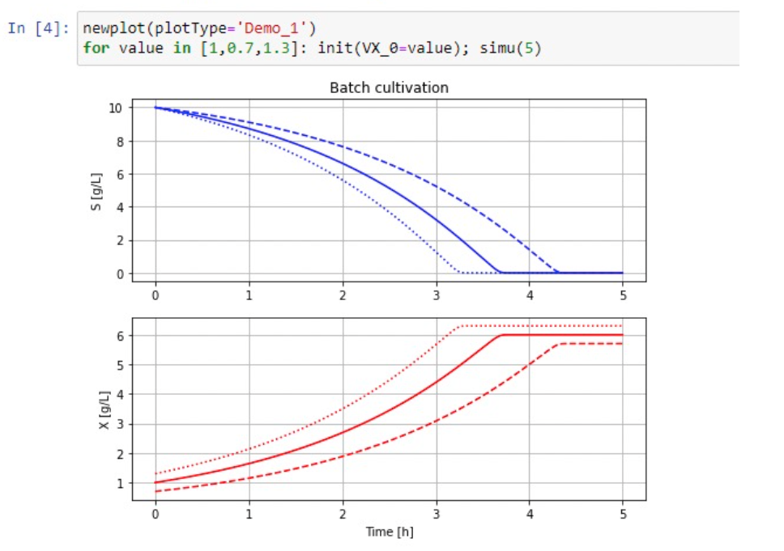
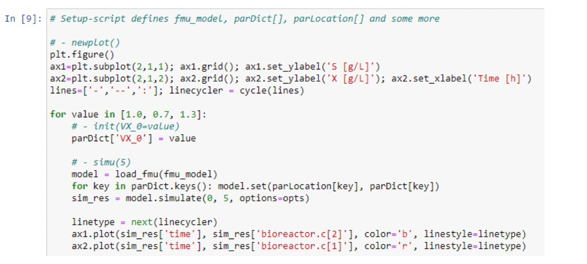

# FMU_explore
The purpose of this software is to provide a simplified, yet powerful, interface to run simulations in Jupyter notebooks in a Python environment using pre-compiled FMUs from Modelica distributions. 

The simplified interface is especially useful when simulations are used in teaching where the focus is on dynamics of the process, rather than on Python scripting. The examples below illustrate the virtue of the simplified user interface.

Figure 1. Two lines of code using FMU\_explore to make the following diagrams

Figure 2. The corresponding plain Python-script to make the same diagrams

Here is a need in a Jupyter notebook context for:

* Simplified code
* Improved readability
* Facilitate change of simulator-engine without changing the notebook
* Same notebook for both Windows and Linux environment

The package FMU\_explore try to meet these needs, by introducing a handfull of functions adapted to the context of the application. The user provides short names of important parameters and variables as well as definitions of standard plots. The main ideas behind the package were presented in OpenModelica workshops a few years ago, see references below.

The package contains one module for each simulator-engine, and so far:

* fmu\_explore\_pyfmi - using PyFMI - https://github.com/modelon-community/PyFMI
* fmu\_explore\_fmpy - using FMPy - https://github.com/CATIA-Systems/FMPy

License information: The package FMU\_explore is shared under the GPL 3.0 license.

References:

Axelsson, J. P., "Design apsects of FMU\_explore a Python module to complement PyFMI", OpenModelica workshop in Linköping, January 31, 2022,
[abstract](https://github.com/janpeter19/References/blob/main/Axelsson_2022_abstract%20.pdf)
[slides](https://www.openmodelica.org/images/M_images/OpenModelicaWorkshop_2022/1505_Axelsson%202022,%20Design%20aspects%20of%20FMU-explore%20a%20Python%20module%20to%20complement%20PyFMI.pdf).

Axelsson, J. P., "Experience with Google Colab for running Modelica FMU in notebooks and no installation", OpenModelica workshop in Linköping, February 3, 2025, 
[abstract](https://github.com/janpeter19/References/blob/main/Axelsson_2025_abstract.pdf)
[slides](https://openmodelica.org/images/M_images/OpenModelicaWorkshop_2025/2025-02-03_Google_Colab_FMU_Notebooks.pdf).

